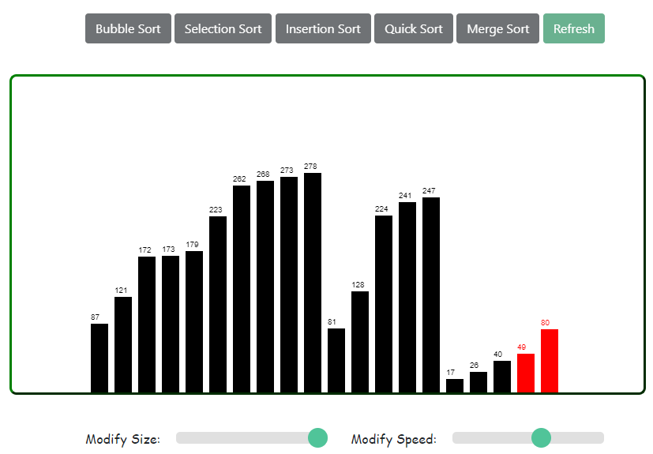

# Visualization of Sorting Algorithms :

A simple web application to visualize how sorting algorithms like bubble sort, selection sort, insertion sort, quick sort and merge sort works.

[Click here](https://prem9141.github.io/Algorithm-Visualizer/) to see the demo.

## Screenshots  

### `Homepage`  

### `Bubble Sort`  

### `Selection Sort`  

### `Insertion Sort`  

### `Quick Sort`  

### `Merge Sort`  

